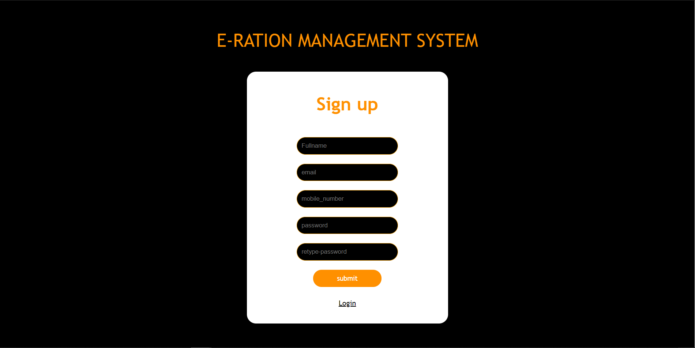
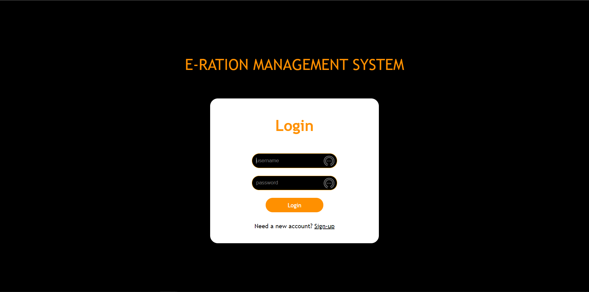

# DBMS-Project
login.html- contains two fields { username, password} with a login button.
Register. html-contains fields like{ username, mobile number, email, password, retype-password} with a register button

